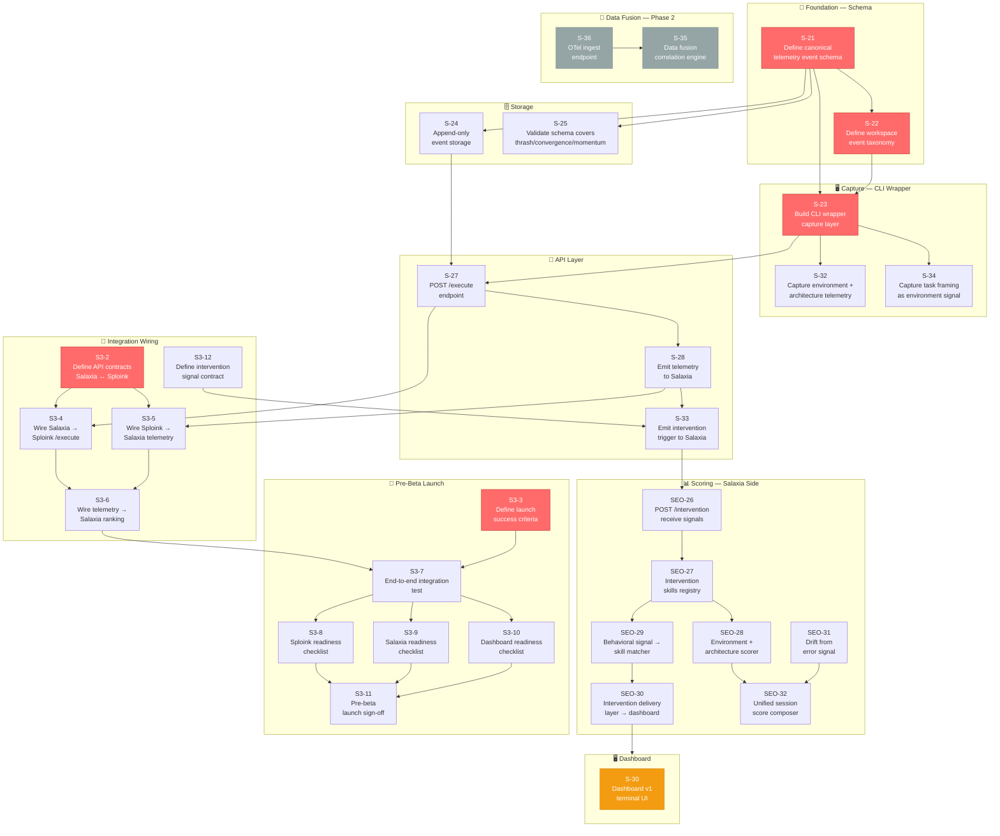

# Sploink Visuals
*Generated March 13, 2026*

---

## 1. Linear Issue Dependency Graph

Paste into any Mermaid renderer (mermaid.live, Notion, GitHub, Obsidian).



**Legend:**
- 🔴 Red = Critical path / must ship before beta
- 🟡 Orange = In Progress
- ⚫ Gray = Phase 2 / Backlog

---

## 2. Sploink Architecture Diagram

```mermaid
flowchart LR

  subgraph AGENT["Agent Process"]
    A1["claude code\ncursor / custom agent"]
  end

  subgraph SPLOINK["Sploink — Execution + Measurement"]
    direction TB
    CLI["CLI Wrapper\nsploink run -- claude ..."]
    SCHEMA["Canonical Event Schema\nsession_id · task_id · event_type · payload"]
    STORE["Append-Only Event Store"]
    SCORE["Scoring Engine\nconvergence · thrash · momentum"]
    API["POST /execute\nPOST /telemetry"]
    DASH["Dashboard\nTerminal UI → Web"]
    FUSION["Data Fusion Layer\nPhase 2 — OTel ingest\n+ correlation engine"]
  end

  subgraph SALAXIA["Salaxia — Routing + Ranking"]
    INTENT["Intent Decomposition\nmulti-candidate routing"]
    RANK["Reputation Graph\nconvergence-weighted ranking"]
    INTER["Intervention Layer\nskill matcher + delivery"]
  end

  subgraph EXTERNAL["External High-Level Tools\nPhase 2"]
    LANGSMITH["LangSmith"]
    ARIZE["Arize / Phoenix"]
    LANGFUSE["Langfuse"]
  end

  A1 -->|"shell commands\nfile edits · git · tests"| CLI
  CLI -->|"raw events"| SCHEMA
  SCHEMA --> STORE
  STORE --> SCORE
  SCORE -->|"session score"| DASH
  SCORE -->|"POST /telemetry"| API
  API -->|"telemetry stream"| SALAXIA

  SALAXIA -->|"POST /execute\ntask_id + intent"| API
  INTENT --> RANK
  RANK --> API
  SCORE -->|"intervention trigger"| INTER
  INTER -->|"skill recommendation"| DASH

  EXTERNAL -->|"OTLP traces\nPOST /ingest/otel"| FUSION
  STORE --> FUSION
  FUSION -->|"fusion_flags\nlie · no-op · loop"| SCORE

  classDef sploink fill:#2ecc71,stroke:#27ae60,color:#fff
  classDef salaxia fill:#3498db,stroke:#2980b9,color:#fff
  classDef phase2 fill:#95a5a6,stroke:#7f8c8d,color:#fff
  classDef agent fill:#e74c3c,stroke:#c0392b,color:#fff

  class CLI,SCHEMA,STORE,SCORE,API,DASH sploink
  class INTENT,RANK,INTER salaxia
  class FUSION,LANGSMITH,ARIZE,LANGFUSE phase2
  class A1 agent
```



---

## 3. Gamma.app Slide Deck Prompt

Paste this directly into [gamma.app](https://gamma.app) → New → "Generate from text":

---

```
Create a product overview slide deck for Sploink. Use a dark, technical aesthetic with green and white accents. Keep slides concise — max 4 bullet points per slide.

SLIDE 1 — TITLE
Sploink
"Every tool tells you what your agent said. We tell you what it did."
Tagline: Behavioral telemetry and real-time intervention for coding agents.

SLIDE 2 — THE PROBLEM
Agents look busy. They're not.
- LangSmith, Langfuse, and AgentOps trace LLM calls — what the agent said
- No tool measures what the agent actually did at the system level
- An agent can make 50 clean LLM calls and still be stuck in a loop
- You can't see this with call tracing. You need execution telemetry.

SLIDE 3 — THE INSIGHT
Two types of telemetry. Only one tells the truth.
- HIGH LEVEL: LLM calls, tool invocations, prompt/response (LangSmith, Arize)
- LOW LEVEL: file edits, shell commands, git state, process spawns (Sploink)
- Fusing both reveals what neither can see: agents that lie, loop, or stall
- Example: agent claims to run tests → no test process spawned → caught.

SLIDE 4 — THE PRODUCT
Drop-in CLI wrapper. Zero behavior change.
- sploink run -- claude "refactor auth module"
- Wraps any agent session, captures all system-level behavior
- Three signals: Convergence score · Thrash detection · Momentum curve
- Live terminal dashboard shows whether the agent is making real progress

SLIDE 5 — HOW IT WORKS
Five layers, one data stream.
- Layer 1: CLI Wrapper — captures shell, file, git, test, build events
- Layer 2: Canonical Event Schema — append-only, immutable, framework-agnostic
- Layer 3: POST /execute — receives task context from Salaxia routing layer
- Layer 4: Telemetry Emission — closes the feedback loop to ranking
- Layer 5: Dashboard — convergence curve + thrash alert + momentum score

SLIDE 6 — COMPETITIVE MOAT
No one else has all three.
Table comparing Sploink vs LangSmith vs Langfuse vs AgentOps vs Arize:
- System-level telemetry: Sploink ✓, others ✗
- Real-time intervention: Sploink ✓, others ✗
- CLI wrapper: Sploink ✓, others ✗
- Convergence/thrash detection: Sploink ✓, others ✗
- Agent ranking loop: Sploink ✓, others ✗

SLIDE 7 — ROADMAP
Four phases to OS-level visibility.
- Phase 1 (Now): CLI wrapper + behavioral telemetry dashboard
- Phase 2 (Q2 2026): IDE extension + OTel data fusion + multi-session intelligence
- Phase 3 (Q3-Q4 2026): eBPF kernel probes — memory, syscall entropy, I/O loops
- Phase 4 (2027+): Agent-native OS — agents as kernel-level primitives

SLIDE 8 — THE DATA MOAT
Every session makes us harder to copy.
- Execution trace data accumulates with every run
- LangSmith could add system capture tomorrow — they can't add two years of behavioral training data
- Whoever defines the canonical event schema becomes the OpenTelemetry for agents
- eBPF requires 12+ months of systems engineering — not a sprint

SLIDE 9 — TEAM
Built by the S³ stack team.
- Timothy Nguyen — Founder, product and architecture
- Ved Sharma — Co-Founder, owns all of Sploink engineering
- Aryan Pandit — Co-Founder, owns Salaxia routing and ranking layer
- Pre-beta launch: March 15, 2026

SLIDE 10 — CALL TO ACTION
We're looking for power users.
- If you run coding agents in your terminal, we want you in the beta
- Install in one command. See your agent's behavior in real time.
- Contact: [your email / link]
```

---

*To use: go to gamma.app → New presentation → Paste the text above → Generate*
